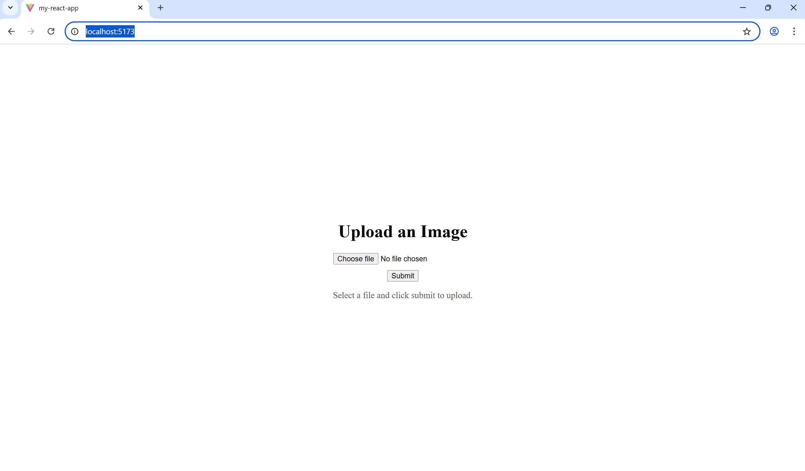

# APL Technical

APLTechnical – Developer Guide

This document provides complete setup instructions for:

- Running Entity Framework Core migrations

- Configuring image storage (FileSystem or Blob Storage)

- Setting up Azurite (local blob emulator)

- Adding the required appsettings.json

- Creating and running the React + Vite frontend app

# Running Entity Framework Core migrations
In the APLTechnical.Infrastructure C# Project, I've left instructions on how to add a migration and a command to update the database. The File is MigrationCommands.txt. Amend the value for SqlConnectionString found in the appsettings.json found in the APLTechnical.Api project, then Run the commands in the package manager console.

# Configuring SQL + image storage (FileSystem or Blob Storage)
To choose the ability to save images either to a FileSystem or Blob Storage, amend the value of ImageStorageProvider in appsettings.json. Possible values are "FileSystem" | "BlobStorage".

# Setting up Azurite (local blob emulator)
To set up a blob container locally on your machine, you will need to install azurite. Once you have azurite running, create a blob container with a name. Currently, the name of the container the application saves to by default is named "images". You can change that in the BlobStorageConfiguration. Can make changes in the future to make this configurable from either appsettings etc.

```csharp
public class BlobStorageConfiguration
{
    public string ConnectionString { get; set; } = string.Empty;
    public string ContainerName { get; set; } = "images";
}
```
# Adding the required appsettings.json
If not found already after downloading this repository, copy this into an appsettings.json file and place in APLTechnical.Api. 
```json
{
  "APLTechnical": {
    "ImageStorageProvider": "FileSystem", // Options: "FileSystem" | "BlobStorage"
    "SqlConnectionString": "Data Source=(localdb)\\MSSQLLocalDB;Initial Catalog=apltest;Integrated Security=True;Persist Security Info=False;Pooling=False;MultipleActiveResultSets=False;Encrypt=True;TrustServerCertificate=True;Application Name=APLTechnicalApi;Command Timeout=30",
    "BlobStorage": {
      "ConnectionString": "AccountName=devstoreaccount1;AccountKey=Eby8vdM02xNOcqFlqUwJPLlmEtlCDXJ1OUzFT50uSRZ6IFsuFq2UVErCz4I6tq/K1SZFPTOtr/KBHBeksoGMGw==;DefaultEndpointsProtocol=http;BlobEndpoint=http://127.0.0.1:10000/devstoreaccount1;QueueEndpoint=http://127.0.0.1:10001/devstoreaccount1;TableEndpoint=http://127.0.0.1:10002/devstoreaccount1;"
    },
    "ImageFileSystemRoot": "C:\\ImageStorage"
  },

  "Logging": {
    "LogLevel": {
      "Default": "Information",
      "Microsoft.AspNetCore": "Warning"
    }
  },

  "AllowedHosts": "*"
}
```
# Running the React + Vite frontend app
The front end is hosted separately to backend. To run locally, you will need to do the following:

1. ```cd my-react-app``` - Go in to correct route folder (optional)
2. ```npm run build``` - This will build the code
3. ```npm run dev``` - This will run the react dev server
4. I've created a launch.json file so, you can just start debugging by using those settings. It will create a new window in Chrome.
5. Hopefully, you can now see the UI. :)



## Incomplete Work
Still yet to complete:
- Bdd Tests
- Some Unit Tests
- One or two config settings are hard coded including the file types we validate for.
- Would need some work to get this deployable in to azure like pipelines etc. 